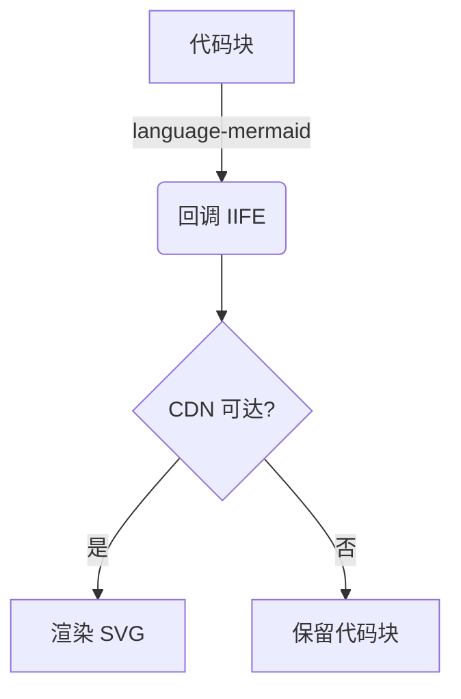
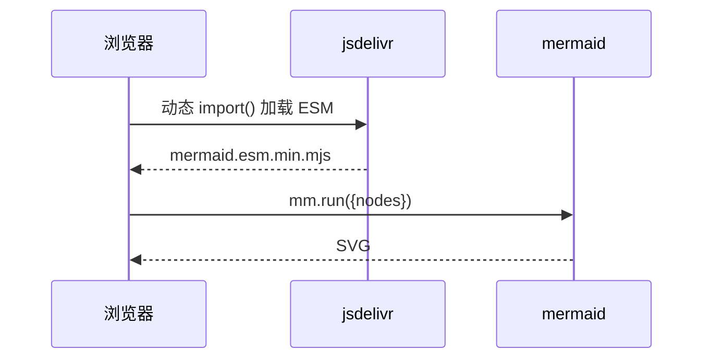

结构化测试页

## 流程图

```mermaid
graph TD;
    A[代码块] -->|language-mermaid| B(回调 IIFE);
    B --> C{CDN 可达?};
    C -->|是| D[渲染 SVG];
    C -->|否| E[保留代码块];
```

## 时序图

```mermaid
sequenceDiagram
    participant 浏览器
    participant jsdelivr
    participant mermaid
    浏览器->>jsdelivr: 动态 import() 加载 ESM
    jsdelivr-->>浏览器: mermaid.esm.min.mjs
    浏览器->>mermaid: mm.run({nodes})
    mermaid-->>浏览器: SVG
```
